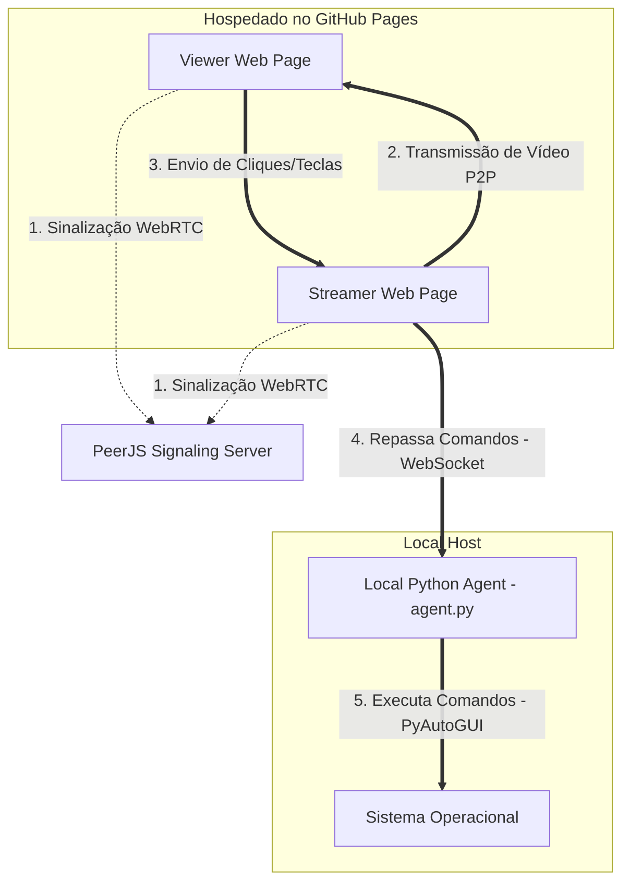

# Especificação de Design - TeleStream Remote

Este documento descreve o design e a arquitetura do **TeleStream Remote**, um sistema de transmissão de tela de alta performance com capacidade de controle remoto. O sistema é composto por um frontend estático hospedado no GitHub Pages e um agente local em Python para simulação de comandos de mouse e teclado.

## 1. Arquitetura do Sistema

O sistema é dividido em três componentes principais:
1.  **Viewer (Cliente Visualizador - Web):** Página web onde o usuário assiste à transmissão de tela e envia comandos de controle (mouse e teclado).
2.  **Streamer (Cliente Transmissor - Web):** Página web executada no computador que deseja transmitir a tela. Ela captura o vídeo do sistema operacional, cria a conexão WebRTC e repassa os comandos de controle para o agente local.
3.  **Local Agent (Agente Python Auxiliar - Local):** Script executado localmente na máquina do transmissor que recebe os comandos do navegador do Streamer via WebSocket local e os simula no sistema operacional.



## 2. Fluxo de Dados e Comunicação

### 2.1 Conexão WebRTC (P2P via PeerJS)
*   O **Streamer** se conecta à rede PeerJS e obtém um ID (ex: `telestream-streamer-1234`).
*   O **Viewer** insere o ID do Streamer e inicia a conexão.
*   O servidor de sinalização do PeerJS ajuda os dois navegadores a estabelecerem uma conexão direta ponto-a-ponto (WebRTC).
*   Uma vez conectados, o canal de mídia (`MediaStream`) transmite o vídeo do Streamer para o Viewer com compressão nativa (H.264 ou VP8/VP9).
*   Um canal de dados (`DataChannel`) é aberto em paralelo para o envio dos comandos do Viewer para o Streamer.

### 2.2 Controle Remoto e Mapeamento de Coordenadas
Para garantir que o mouse clique na posição correta mesmo que o transmissor e o visualizador possuam resoluções de tela diferentes:
1.  O **Viewer** captura a posição do clique relativa à imagem do vídeo, gerando coordenadas entre `0.0` e `1.0` (ex: `x = 0.5`, `y = 0.5` representa o centro exato da tela do vídeo).
2.  O **Viewer** envia essa coordenada relativa no canal WebRTC: `{"type": "mousemove", "x": 0.5, "y": 0.5}`.
3.  O **Streamer** recebe esse JSON e repassa-o diretamente para o WebSocket local do Agente Python (`ws://localhost:9000`).
4.  O **Agente Python** lê as dimensões reais da tela principal do sistema (usando `pyautogui.size()`) e calcula a posição absoluta: `X_abs = x * largura_tela`, `Y_abs = y * altura_tela`.
5.  O **Agente Python** move o mouse para a posição calculada e executa o clique.

## 3. Protocolo de Mensagens (JSON)

As mensagens trafegadas no DataChannel e no WebSocket local seguem a seguinte estrutura:

### Movimento do Mouse
```json
{
  "type": "mousemove",
  "x": 0.1234,
  "y": 0.5678
}
```

### Clique do Mouse
```json
{
  "type": "mousedown",
  "button": "left" | "right" | "middle"
}
```
e
```json
{
  "type": "mouseup",
  "button": "left" | "right" | "middle"
}
```

### Rolagem (Scroll)
```json
{
  "type": "scroll",
  "deltaY": -100
}
```

### Teclado
```json
{
  "type": "keydown",
  "key": "a"
}
```
e
```json
{
  "type": "keyup",
  "key": "a"
}
```

## 4. Tecnologias Utilizadas
1.  **HTML5 / Vanilla CSS / Vanilla JavaScript**: Sem frameworks complexos para garantir carregamento instantâneo e facilidade de deploy estático.
2.  **PeerJS (JavaScript)**: Biblioteca WebRTC simplificada para gerenciamento de conexões ponto-a-ponto e sinalização.
3.  **Python 3**:
    *   `websockets`: Servidor WebSocket leve de baixa latência para comunicação local.
    *   `pyautogui`: Biblioteca de controle do mouse e teclado do SO.

## 5. Medidas de Segurança e Robustez
*   **Acesso Local Restrito:** O servidor WebSocket no agente Python escuta estritamente no endereço `127.0.0.1` (localhost). Computadores externos na rede não podem enviar comandos diretamente para ele.
*   **Mecanismo de Fail-Safe:** O PyAutoGUI tem um recurso de desligamento automático se o cursor for movido manualmente para qualquer um dos quatro cantos da tela.
*   **Controle de Permissão WebRTC:** O compartilhamento de tela requer consentimento explícito do usuário através do navegador de forma nativa (caixa de diálogo do sistema).
*   **Botão de Desativação Rápida:** O Viewer possui um botão "Ativar Controle" que habilita ou desabilita o envio de comandos instantaneamente.

## 6. Estrutura de Arquivos Proposta
```text
/
├── index.html            # Interface unificada (Dashboard, Streamer e Viewer)
├── app.js                # Lógica da interface, WebRTC e WebSocket
├── styles.css            # Estilização moderna (Modo Escuro & Glassmorphism)
├── agent.py              # Agente Python local de controle
└── README.md             # Instruções de uso e inicialização
```
